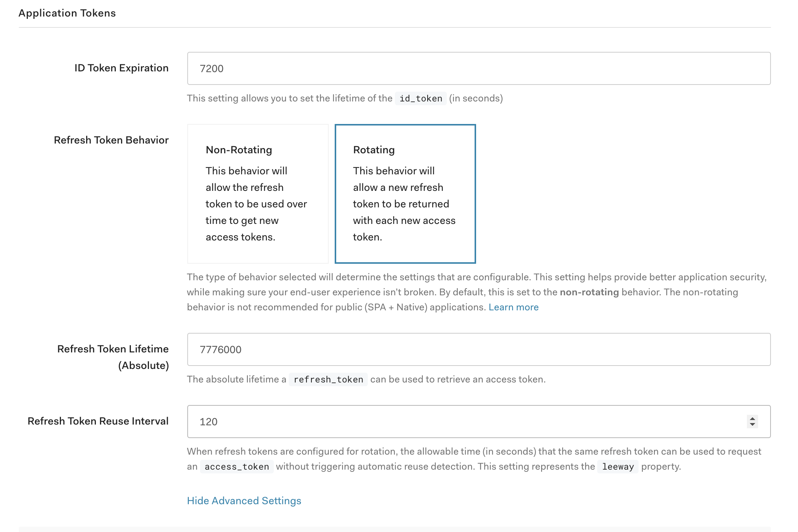

### Summary
Due to the nature of the application we are building, our users are peforming a lot of authorized requests from multiple browser tabs. We are using Auth0 SPA SDK v1.12.1 with the settings you can view here: https://github.com/smogg/auth-mutli-tab-issue/blob/07f6059eab4374d02622853afaf56edf2e102343/app.js#L2-L9
Notably, we use Refresh Token Rotation with localStorage as cache location.

### The problem
When multiple tabs are open, at some point two (or more) tabs will request a new Access Token using the same Refresh Token stored in localStorage. If I understand what the Auth0 SPA SDK offers, this should be prevented, however it doesn't seem like that's the case. A similar issue is tracked here: https://github.com/auth0/auth0-spa-js/issues/553

**This problem is affecting thousands of our users and we consider it a critical issue.**

### Steps to reproduce
1. Start the server `./server.sh` and open http://localhost:8080 in your browser
1. After signing in, open multiple tabs pointed at the same url
1. In each of those tabs press the "start" button. This will set an interval which performs the `.getTokenSilently` every 50ms.
1. In one of the tabs, click on `expire` token. At some point you'll see the server responding with `403 invalid_grant` (which means automatic reuse detection was triggered)

### Mitigation
As a long term solution, we plan to implement our own locking solution to avoid this from happening.

Short-term however, we wanted to increase the `leeway` value for the Refresh Token to mitigate the problem for the end user. While this increases the security risks, the current end-user behavior outweighs them.

The following screenshots represents the token settings for the application used in this demo:

If we understand the setting correctly, it should prevent the problem from occuring (the Leeway is described in more detail [in this article on Auth0 blog](https://auth0.com/blog/securing-single-page-applications-with-refresh-token-rotation/)). Currently the `leeway` value doesn't seem to have any effect for the problem at hand.
